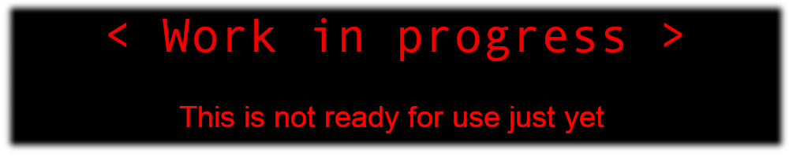

# Oskar's Half-Life Tools
<sub>Half-Life engine map compile tools based on [SDHLT](https://github.com/seedee/SDHLT), VHLT, and ZHLT.</sub>



*TODO: Describe new features and improvements in OHLT here*
New features such as MacOS support, -fallback-encoding

New features *in SDHLT* include shadows from studiomodels, new entities, additional tool textures, ability to extend world size limits, portal file optimisation for J.A.C.K. map editor and minor algorithm optimization.

## Compiling the compilers
```
cmake -S . --preset=release-default
cmake --build --preset=release-default
```


## How to install

1. Open the configuration dialog of your map editor or batch compiler.
2. Set CSG, BSP, VIS, RAD tool paths to *hlcsg.exe*, *hlbsp.exe*, *hlvis.exe*, and *hlrad.exe*.
3. Add *hlt.wad* to your WAD list. This is required to compile maps.
4. Add *hlt.fgd* to your FGD list.

## Features
These are from SDHLT. A new feature list will be written for OHLT.

### Studiomodel shadows

Entities with a `model` keyvalue, such as *env_sprite* or *cycler_sprite*, support the use of `zhlt_studioshadow 1` to flag the studiomodel as opaque to lighting. Additionally, `zhlt_shadowmode n` is used to control the shadow tracing mode.  
The default `1` will trace for each triangle and supports transparent textures.  
Setting `2` doesn't support transparency, but it traces the planes bbox for each triangle, the slowest but usually higher quality for some models.  
Setting `0` disables tracing and uses the mesh bbox instead.

To implement these into your own fgd file for SmartEdit, use the template at the top of *hlt.fgd*. If the new shadow covers the origin and makes it too dark, set a custom `light_origin` on the entity or move the mesh origin point externally.

### Entities

- *info_portal* and *info_leaf* are used to create a portal from the leaf the *info_portal* is inside, to the selected leaf the *info_leaf* is inside. Forces target leaf to be visible from the current one, making all entities visible.
- *info_minlights* used to set minlights for textures, works on world geometry too. Works similarly to `_minlight` but per-texture.

### Textures

- Support for `%` texture flag, sets the minlight for this texture. **%texname** alone is equivalent to `_minlight 1.0`, while **%`#`texname** where **`#`** is an integer in a range of `0-255`.
- **BEVELHINT** texture, which acts like **SOLIDHINT** and **BEVEL**. Eliminates unnecessary face subdivision and bevels clipnodes at the same time. Useful on complex shapes such as terrain, spiral staircase clipping, etc.
- **SPLITFACE** texture. Brushes with this texture will subdivide faces they touch along their edges, similarly to `zhlt_chopdown`.
- **cur_tool** textures, which act like **CONTENTWATER** and *func_pushable* with a speed of `2048 units/s` in -Y. This texture is always fullbright.

### Compile parameters

- `-extra` RAD parameter now sets `-bounce 12` for a higher quality of lighting simulation.
- `-worldextent n` CSG parameter. Extends map geometry limits beyond `+/-32768`.
- Portal file reformatting for J.A.C.K. map editor, allows for importing the prt file into the editor directly after VIS. Use `-nofixprt` VIS parameter to disable.
- `-nostudioshadow` RAD parameter to ignore `zhlt_studioshadow` on studiomodels.

## Contributors
These compile tools contain code by various people including Oskar Larsson Högfeldt AKA Oskar_Potatis, Sean "Zoner" Cavanaugh, Ryan "Nemesis" Gregg, amckern, Tony "Merl" Moore, Vluzacn, Uncle Mike, and seedee. Based on Valve's compile tools, modified with permission.
